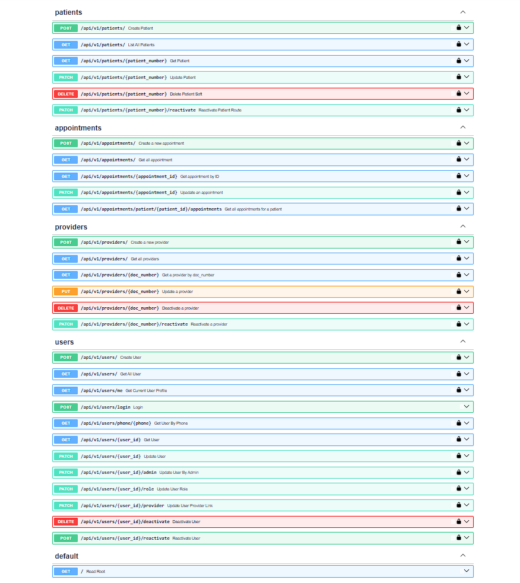

# Patient Management System

[Patient Management API](https://patient-management-api-m3mw.onrender.com)

A backend API for clinics and small hospitals to manage patients, providers, appointments, and staff accounts. Built with FastAPI and PostgreSQL, designed for real deployment with JWT authentication, role-based access control, rate limiting, and containerized delivery.

## What It Does

Clinics need a single system to:
* Register patients and track their visits
* Manage doctor and staff accounts
* Schedule appointments and prevent double bookings
* Control who can do what (front desk vs. doctors vs. administrators)
* Protect login endpoints from brute-force attacks

This API handles all of that. It is the backend only — no UI. Any frontend (web, mobile, or internal tool) can consume it.

## Features

* **Patient management** — registration, search, soft delete, reactivation
* **Provider management** — doctor records with auto-generated identifiers
* **Appointment scheduling** — overlap prevention, status lifecycle, provider assignment
* **Authentication** — JWT-based login with phone + password
* **Authorization** — three roles: ADMIN, DOCTOR, RECEPTIONIST
* **Rate limiting** — sliding window on login, backed by Redis
* **Audit trails** — every record tracks who created and last updated it
* **Structured logging** — JSON logs in production, human-readable in development
* **Health checks** — for orchestrators and load balancers

## Tech Stack

| Layer | Technology |
|---|---|
| **Language** | Python 3.14 |
| **Web framework** | FastAPI |
| **Database** | PostgreSQL 16 |
| **ORM** | SQLAlchemy 2.0 |
| **Migrations** | Alembic |
| **Validation** | Pydantic v2 |
| **Authentication** | JWT (python-jose) |
| **Rate limiting** | Redis 7, sliding window |
| **Testing** | pytest |
| **Containerization** | Docker, Docker Compose |
| **CI** | GitHub Actions |

## Quick Start

Requires Docker and Docker Compose.

```bash
git clone [https://github.com/Head2On/Patient-management-system.git](https://github.com/Head2On/Patient-management-system.git)
cd Patient-management-system
docker compose up -d
docker compose exec api alembic upgrade head
docker compose exec api python scripts/create_admin.py \
  --phone 9999999999 \
  --password AdminPass123 \
  --email admin@hospital.com
```

Open `http://localhost:8000/docs` for the interactive API documentation.

Log in via `POST /api/v1/users/login` with the admin credentials above. Use the returned token as `Authorization: Bearer <token>` for all subsequent requests.

## Roles and Permissions

| Role | Scope |
|---|---|
| **ADMIN** | Full access. Creates users, changes roles, manages providers. |
| **RECEPTIONIST** | Registers patients, books appointments, deactivates users. No admin actions. |
| **DOCTOR** | Views patients and appointments, updates clinical notes and appointment status. No user management. |

### Business rules enforced at the service layer:
* DOCTOR role requires a linked provider record.
* ADMIN and RECEPTIONIST cannot be linked to a provider.
* A provider can be linked to at most one user.
* Appointments cannot overlap for the same patient or provider.
* Inactive patients cannot receive new appointments.

## Running Tests

Tests run against a separate PostgreSQL database and use a real Redis instance. In CI, both are provided as service containers.

Local run:
```bash
docker compose exec api pytest tests/ -v
```
The suite covers services, routes, schemas, authentication, rate limiting, and logging. Total: 421 tests.

## Local Development Without Docker

```bash
python -m venv .venv
source .venv/bin/activate  # On Windows use: .venv\Scripts\activate
pip install -r requirements.txt
```

Start Postgres and Redis (locally or via docker compose), then set up your environment and run the app:

```bash
# Set your .env
cp .env.example .env  # edit as needed

# Run migrations and start the server
alembic upgrade head
uvicorn app.main:app --reload
```

Run local tests:
```bash
pytest tests/ -v
```

## Configuration

Environment variables (set via `.env`, `docker-compose.yml`, or the deployment platform):

   Variable                          Purpose 
|
| `DATABASE_URL` | PostgreSQL connection string |
| `TEST_DATABASE_URL` | Test database connection string |
| `SECRET_KEY` | JWT signing key |
| `ALGORITHM` | JWT algorithm (default HS256) |
| `ACCESS_TOKEN_EXPIRE_MINUTES` | Token lifetime |
| `REDIS_URL` | Redis connection string |
| `LOGIN_RATE_LIMIT` | Login attempts allowed per window |
| `LOGIN_RATE_WINDOW` | Rate limit window in seconds |
| `DEBUG` | Development logging if true |

## Project Structure

```text
app/
├── api/routes/       HTTP endpoints
├── core/             Config, security, logging, rate limiter, Redis
├── db/               Database session and engine
├── models/           SQLAlchemy models
├── schemas/          Pydantic schemas
└── services/         Business logic

alembic/              Database migrations
scripts/              Operational scripts (admin seeding)
tests/                Test suite
docs/                 Architecture, API, and database notes
```


